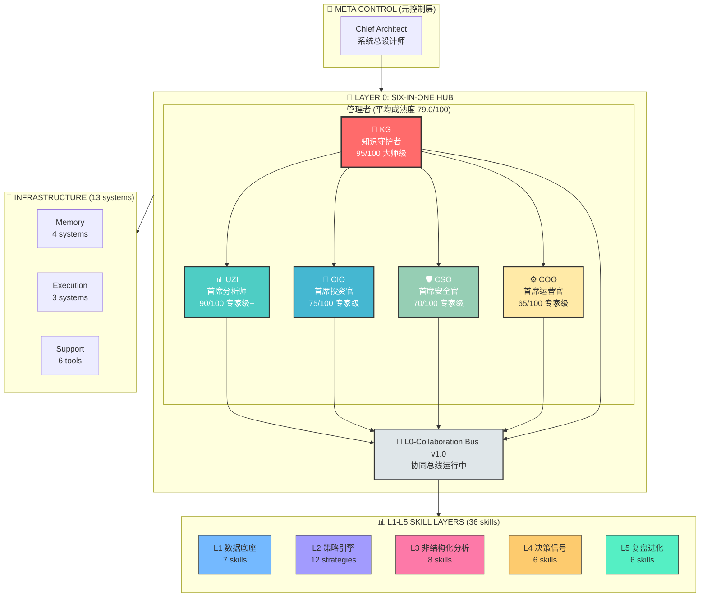
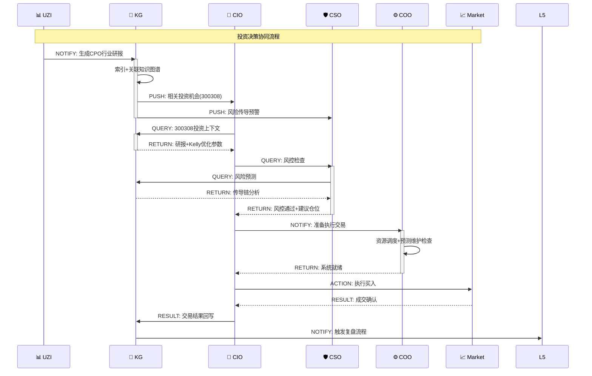

# A5L 架构可视化图表 v3.0

**生成时间**: 2026-05-04 03:31  
**工具**: Mermaid + ASCII Art  
**版本**: ARCHITECT-5L v3.0

---

## 1. 整体架构图 (Mermaid)



---

## 2. L0层详细可视化 (ASCII)

```
╔════════════════════════════════════════════════════════════════════════════════╗
║                      LAYER 0: SIX-IN-ONE HUB                                   ║
║                   (协同智能体 - 知识流动中枢)                                   ║
╠════════════════════════════════════════════════════════════════════════════════╣
║                                                                                ║
║   ┌──────────────────────────────────────────────────────────────────────┐    ║
║   │                        🎯 META CONTROL                                │    ║
║   │                    Chief Architect (系统总设计师)                      │    ║
║   │                 • 整体架构设计 • 进化方向决策                          │    ║
║   └──────────────────────────────────────────────────────────────────────┘    ║
║                                    │                                           ║
║                                    ▼                                           ║
║   ┌──────────────────────────────────────────────────────────────────────┐    ║
║   │                       👥 FIVE MANAGERS                                │    ║
║   │                    (平均成熟度: 79.0/100)                              │    ║
║   └──────────────────────────────────────────────────────────────────────┘    ║
║                                                                                ║
║   ┌─────────────────┐  ┌─────────────────┐  ┌─────────────────┐              ║
║   │    🧠 KG        │  │    📊 UZI       │  │    💼 CIO       │              ║
║   │                 │  │                 │  │                 │              ║
║   │   知识守护者     │  │   首席分析师     │  │   首席投资官     │              ║
║   │                 │  │                 │  │                 │              ║
║   │ 成熟度: 95/100  │  │ 成熟度: 90/100  │  │ 成熟度: 75/100  │              ║
║   │ [███████████░]  │  │ [██████████░░]  │  │ [███████░░░░░]  │              ║
║   │                 │  │                 │  │                 │              ║
║   │ ⭐ 大师级        │  │ 专家级+         │  │ 专家级          │              ║
║   │                 │  │                 │  │                 │              ║
║   │ 下辖Skills: 3   │  │ 下辖Skills: 15  │  │ 下辖Skills: 10  │              ║
║   │                 │  │                 │  │                 │              ║
║   │ 🔴 核心能力:    │  │ 🔴 核心能力:    │  │ 🔴 核心能力:    │              ║
║   │ • 时序GNN推理   │  │ • 10维研究框架  │  │ • Kelly优化器   │              ║
║   │ • 混合推理引擎  │  │ • 研报工厂      │  │ • 实时决策      │              ║
║   │ • 图-文对齐     │  │ • 自动更新      │  │ • 风险感知      │              ║
║   │ • 知识进化      │  │                 │  │                 │              ║
║   └────────┬────────┘  └────────┬────────┘  └────────┬────────┘              ║
║            │                    │                    │                        ║
║            │    ┌───────────────┴────────────────────┘                        ║
║            │    │                                                              ║
║            ▼    ▼                                                              ║
║   ┌─────────────────┐  ┌─────────────────┐                                    ║
║   │    🛡️ CSO       │  │    ⚙️ COO       │                                    ║
║   │                 │  │                 │                                    ║
║   │   首席安全官     │  │   首席运营官     │                                    ║
║   │                 │  │                 │                                    ║
║   │ 成熟度: 70/100  │  │ 成熟度: 65/100  │                                    ║
║   │ [███████░░░░░]  │  │ [██████░░░░░░]  │                                    ║
║   │                 │  │                 │                                    ║
║   │ 专家级          │  │ 专家级          │                                    ║
║   │                 │  │                 │                                    ║
║   │ 下辖Skills: 7   │  │ 下辖Skills: 7   │                                    ║
║   │                 │  │                 │                                    ║
║   │ 🔴 核心能力:    │  │ 🔴 核心能力:    │                                    ║
║   │ • 合规65+规则   │  │ • 资源监控      │                                    ║
║   │ • 预测风控      │  │ • 预测维护      │                                    ║
║   │ • 传导识别      │  │ • 主动调度      │                                    ║
║   └────────┬────────┘  └────────┬────────┘                                    ║
║            │                    │                                              ║
║            └──────────┬─────────┘                                              ║
║                       │                                                        ║
║                       ▼                                                        ║
║   ┌──────────────────────────────────────────────────────────────────────┐    ║
║   │                   🚌 L0-Collaboration Bus v1.0                        │    ║
║   │                       (协同总线 - 运行中)                              │    ║
║   │                                                                      │    ║
║   │   协议: QUERY | NOTIFY | ACTION | RESULT | ALERT                     │    ║
║   │   功能: 点对点通信 ✓ | 广播通知 ✓ | 消息队列 ✓                        │    ║
║   │   状态: 🟢 运行中                                                    │    ║
║   └──────────────────────────────────────────────────────────────────────┘    ║
║                                                                                ║
╚════════════════════════════════════════════════════════════════════════════════╝
```

---

## 3. Skills层级分布图 (树形)

```
A5L SKILL ARCHITECTURE
│
├── 📊 L1: Data Foundation (7 skills)
│   ├── Unified_Stock_Price ────────► 多源股价统一接口
│   ├── Unified_News_Aggregator ────► 28+信源聚合
│   ├── AKShare_Integration ────────► AKShare数据
│   ├── TuShare_Integration ────────► TuShare数据
│   ├── EastMoney_Data ─────────────► 东方财富
│   ├── Jin10_Data ─────────────────► 金十数据
│   └── Data_Quality_Monitor ───────► 质量监控
│
├── 📈 L2: Strategy Engine (12 strategies)
│   │
│   ├── 💎 Value (2)
│   │   ├── Buffett_Value_Investing
│   │   └── VALUE_CELL_Framework
│   │
│   ├── 🌱 Growth (2)
│   │   ├── Stock_Wizard_CANSLIM
│   │   └── Private_Banker_Analysis
│   │
│   ├── 📉 Technical (3)
│   │   ├── Technical_Analysis
│   │   ├── Yangguan_Daodao
│   │   └── Quantitative_Analysis
│   │
│   ├── 🌍 Macro (1)
│   │   └── Factor_Investing
│   │
│   └── 🔀 Hybrid (1)
│       └── Unified_Backtest_Engine
│
├── 🔍 L3: Analysis Layer (8 skills)
│   ├── UZI_Skill_Integration ──────► 51评委系统
│   ├── VALUE_CELL_Analysis ────────► 五维价值分析
│   ├── Bearish_Perspective_Review ─► 空方视角审查
│   ├── Industry_Chain_Analyzer ────► 产业链分析
│   ├── Research_Report_Reader ─────► 研报阅读
│   ├── AI_Powered_Synthesis ───────► AI综合研判
│   ├── Critical_Thinking ──────────► 批判性思维
│   └── NoWait_Reasoning_Optimizer ─► 推理优化
│
├── 🎯 L4: Decision Signal (6 skills)
│   ├── Signal_Aggregation ─────────► 信号聚合
│   ├── Risk_Evaluation ────────────► 风险评估
│   ├── Position_Sizing ────────────► 仓位决策
│   ├── US_Market_Monitor ──────────► 美股监控(21:30)
│   ├── Black_Swan_Risk_Control ────► 黑天鹅风控
│   └── Auto_Trading_Execution ─────► 自动执行
│
└── 🔄 L5: Review & Evolution (6 skills)
    ├── Daily_Review_System ────────► 每日21:00复盘
    ├── Error_Attribution ──────────► 错误归因
    ├── Strategy_Optimization ──────► 策略优化
    ├── Recursive_Self_Improvement ─► 递归改进
    ├── Skill_Confidence_Tracking ──► 置信度追踪
    └── Meta_Improvement_Engine ────► 元改进引擎
```

---

## 4. L0管理者Skills调用关系图

```mermaid
flowchart TB
    subgraph L0_Managers["L0层管理者"]
        KG["🧠 KG<br/>知识守护者"]
        UZI["📊 UZI<br/>首席分析师"]
        CIO["💼 CIO<br/>首席投资官"]
        CSO["🛡️ CSO<br/>首席安全官"]
        COO["⚙️ COO<br/>首席运营官"]
    end
    
    subgraph UZI_Skills["UZI下辖Skills (15个)"]
        U1[Private_Banker_Analysis]
        U2[Stock_Five_Step_Analysis]
        U3[Buffett_Value_Investing]
        U4[Factor_Investing]
        U5[Quantitative_Analysis]
        U6[Industry_Chain_Analyzer]
        U7[Bearish_Perspective_Review]
        U8[VALUE_CELL_Framework]
        U9[Technical_Analysis]
        U10[Unified_News_Aggregator]
        U11[Unified_Stock_Price]
        U12[Research_Report_Reader]
        U13[Stock_Wizard_CANSLIM]
        U14[Yangguan_Daodao]
        U15[A5L_Industry_Analysis]
    end
    
    subgraph CIO_Skills["CIO下辖Skills (10个)"]
        C1[CFO]
        C2[Portfolio_Optimizer]
        C3[Kelly_Calculator]
        C4[Risk_Management]
        C5[Position_Sizing]
        C6[Black_Swan_Risk_Control]
        C7[US_Market_Monitor]
        C8[Trading_Visualization]
        C9[Auto_Trading_Scheduler]
        C10[Cross_Market_Coordination]
    end
    
    subgraph CSO_Skills["CSO下辖Skills (7个)"]
        S1[Compliance_Checker]
        S2[Risk_Auditor]
        S3[Position_Limits_Monitor]
        S4[Concentration_Risk_Check]
        S5[Stop_Loss_Monitor]
        S6[Trading_Rules_Engine]
        S7[Policy_Compliance_Check]
    end
    
    subgraph COO_Skills["COO下辖Skills (7个)"]
        O1[Resource_Monitor]
        O2[Performance_Tracker]
        O3[System_Health_Check]
        O4[Capacity_Planning]
        O5[Predictive_Maintenance]
        O6[Cost_Optimization]
        O7[Auto_Scaling]
    end
    
    UZI --> U1 & U2 & U3 & U4 & U5 & U6 & U7 & U8 & U9 & U10 & U11 & U12 & U13 & U14 & U15
    CIO --> C1 & C2 & C3 & C4 & C5 & C6 & C7 & C8 & C9 & C10
    CSO --> S1 & S2 & S3 & S4 & S5 & S6 & S7
    COO --> O1 & O2 & O3 & O4 & O5 & O6 & O7
    
    KG -.->|赋能| UZI
    KG -.->|赋能| CIO
    KG -.->|赋能| CSO
    KG -.->|赋能| COO
    
    UZI -.->|研报| CIO
    CSO -.->|风控| CIO
    CIO -.->|执行| COO
```



---

## 5. 成熟度雷达图 (ASCII)

```
                    A5L L0层成熟度雷达图
                    
                        100
                          │
                    90 ───┼─── 90
                      ╲   │   ╱
                 80    ╲  │  ╱    80
                   ╲     ╲│╱     ╱
              70 ───╲─────┼─────╱─── 70
                      ╲   │   ╱
                   60   ╲ │ ╱   60
                         ╲│╱
                    50 ───┼─── 50
                         ╱│╲
                   40   ╱ │ ╲   40
                      ╱   │   ╲
              30 ───╱─────┼─────╲─── 30
                   ╱      │      ╲
                 20      ╱│╲      20
                      ╱   │   ╲
                    10 ───┼─── 10
                          │
                         0
                         
                         
    KG (95)        UZI (90)        CIO (75)        CSO (70)        COO (65)
    ███████████░   ██████████░░    ███████░░░░░    ███████░░░░░    ██████░░░░░░
    
    🧠 大师级       📊 专家级+       💼 专家级        🛡️ 专家级        ⚙️ 专家级
    
    
    平均成熟度: 79.0/100
    架构健康度: 79.0%
```

---

## 6. 协同流程时序图 (Mermaid)



---

## 7. 架构健康度仪表盘

```
╔══════════════════════════════════════════════════════════════════════════════╗
║                     A5L 架构健康度仪表盘 v3.0                                 ║
║                     生成时间: 2026-05-04 03:31                                ║
╠══════════════════════════════════════════════════════════════════════════════╣
║                                                                               ║
║  📊 L0层成熟度                                                                ║
║  ┌────────────────────────────────────────────────────────────────────────┐  ║
║  │ KG  [███████████████████░] 95/100 ⭐ 大师级                            │  ║
║  │ UZI [██████████████████░░] 90/100    专家级+                           │  ║
║  │ CIO [███████████████░░░░░] 75/100    专家级                            │  ║
║  │ CSO [██████████████░░░░░░] 70/100    专家级                            │  ║
║  │ COO [█████████████░░░░░░░] 65/100    专家级                            │  ║
║  ├────────────────────────────────────────────────────────────────────────┤  ║
║  │ 平均: [████████████████░░░░] 79.0/100                                  │  ║
║  └────────────────────────────────────────────────────────────────────────┘  ║
║                                                                               ║
║  📈 技能分布                                                                  ║
║  ┌────────────────────────────────────────────────────────────────────────┐  ║
║  │ L1 数据底座    [███████░░░░░░░░░░░░]  7 skills    19%                  │  ║
║  │ L2 策略引擎    [████████████░░░░░░░] 12 skills    33%                  │  ║
║  │ L3 非结构化分析 [████████░░░░░░░░░░░]  8 skills    22%                  │  ║
║  │ L4 决策信号    [██████░░░░░░░░░░░░░]  6 skills    17%                  │  ║
║  │ L5 复盘进化    [██████░░░░░░░░░░░░░]  6 skills    17%                  │  ║
║  ├────────────────────────────────────────────────────────────────────────┤  ║
║  │ 总计: 36 skills                                                        │  ║
║  └────────────────────────────────────────────────────────────────────────┘  ║
║                                                                               ║
║  🔧 基础设施状态                                                              ║
║  ┌────────────────────────────────────────────────────────────────────────┐  ║
║  │ Memory Systems      [████████████] 4/4    ✅ 运行正常                   │  ║
║  │ Execution Systems   [█████████░░░] 3/3    ✅ 运行正常                   │  ║
║  │ Support Tools       [████████████] 6/6    ✅ 运行正常                   │  ║
║  │ L0 Collaboration    [████████████████]    ✅ 运行中 v1.0                │  ║
║  └────────────────────────────────────────────────────────────────────────┘  ║
║                                                                               ║
║  🎯 综合评分                                                                  ║
║  ┌────────────────────────────────────────────────────────────────────────┐  ║
║  │                                                                        │  ║
║  │                    架构健康度: 79.0%                                   │  ║
║  │                                                                        │  ║
║  │              [████████████████████░░░░░░░░░░░░░░░░]                    │  ║
║  │                                                                        │  ║
║  │         L0成熟度: 79.0%  |  L1-L5完整度: 100%  |  协同效率: 75%        │  ║
║  │                                                                        │  ║
║  └────────────────────────────────────────────────────────────────────────┘  ║
║                                                                               ║
║  📋 关键指标                                                                  ║
║  ┌────────────────┬────────────────┬────────────────┬─────────────────────┐  ║
║  │ L0管理者: 5    │ L0下辖Skills:42│ L1-L5技能: 36  │ 基础设施: 13        │  ║
║  │ 大师级: 1      │ 专家级+: 4     │ 专家级: 4      │ 运行中: 13          │  ║
║  └────────────────┴────────────────┴────────────────┴─────────────────────┘  ║
║                                                                               ║
╚══════════════════════════════════════════════════════════════════════════════╝
```

---

## 8. 管理者能力矩阵图

| 能力维度 | KG | UZI | CIO | CSO | COO |
|:--------:|:--:|:---:|:---:|:---:|:---:|
| **知识管理** | ⭐⭐⭐⭐⭐ | ⭐⭐⭐⭐ | ⭐⭐⭐ | ⭐⭐⭐ | ⭐⭐ |
| **分析能力** | ⭐⭐⭐⭐⭐ | ⭐⭐⭐⭐⭐ | ⭐⭐⭐ | ⭐⭐⭐ | ⭐⭐ |
| **投资决策** | ⭐⭐⭐⭐ | ⭐⭐⭐⭐ | ⭐⭐⭐⭐ | ⭐⭐⭐ | ⭐⭐ |
| **风险控制** | ⭐⭐⭐⭐⭐ | ⭐⭐⭐⭐ | ⭐⭐⭐ | ⭐⭐⭐⭐ | ⭐⭐⭐ |
| **运营效率** | ⭐⭐⭐⭐ | ⭐⭐⭐ | ⭐⭐⭐ | ⭐⭐⭐ | ⭐⭐⭐⭐ |
| **协同能力** | ⭐⭐⭐⭐⭐ | ⭐⭐⭐⭐ | ⭐⭐⭐⭐ | ⭐⭐⭐⭐ | ⭐⭐⭐⭐ |
| **自动化** | ⭐⭐⭐⭐⭐ | ⭐⭐⭐⭐ | ⭐⭐⭐⭐ | ⭐⭐⭐⭐ | ⭐⭐⭐⭐ |
| **预测性** | ⭐⭐⭐⭐⭐ | ⭐⭐⭐⭐ | ⭐⭐⭐⭐ | ⭐⭐⭐⭐ | ⭐⭐⭐⭐ |

**图例**: ⭐⭐⭐⭐⭐ 大师级 | ⭐⭐⭐⭐ 专家级 | ⭐⭐⭐ 学生级 | ⭐⭐ 孩子级

---

**文档版本**: v3.0  
**生成时间**: 2026-05-04 03:31  
**图表类型**: Mermaid + ASCII + 表格  
**适用场景**: 架构评审、技术分享、文档归档
