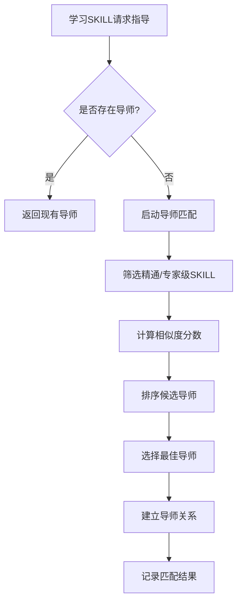
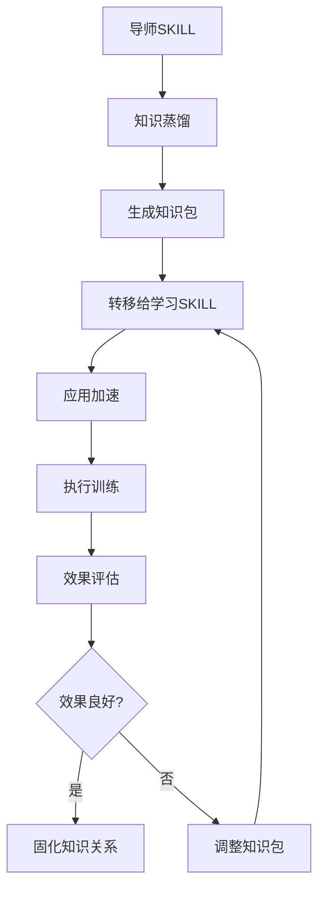

# A5L SKILL导师系统设计文档

## 1. 概述

### 1.1 设计目标
让精通级（95%+）和专家级（80%+）SKILL能够主动指导低熟练度SKILL，实现跨SKILL知识转移和加速学习。

### 1.2 核心问题
- 如何匹配导师SKILL和学习SKILL？
- 如何实现知识的高效转移？
- 如何量化学习加速效果？

---

## 2. 系统架构

```
┌─────────────────────────────────────────────────────────────┐
│                    SKILL导师系统 (SkillMentorSystem)         │
├─────────────────────────────────────────────────────────────┤
│  ┌─────────────────┐  ┌─────────────────┐  ┌─────────────┐ │
│  │ 导师匹配引擎     │  │ 知识蒸馏引擎     │  │ 学习加速器   │ │
│  │ MentorMatcher   │  │ KnowledgeDistiller│  │ LearningAccelerator│ │
│  └────────┬────────┘  └────────┬────────┘  └──────┬──────┘ │
│           │                    │                  │        │
│           ▼                    ▼                  ▼        │
│  ┌────────────────────────────────────────────────────────┐│
│  │              SKILL知识图谱 (SkillKnowledgeGraph)        ││
│  │  • 技能相似度矩阵                                       ││
│  │  • 知识依赖关系                                         ││
│  │  • 训练效果历史                                         ││
│  └────────────────────────────────────────────────────────┘│
│           │                    │                  │        │
│           ▼                    ▼                  ▼        │
│  ┌────────────────────────────────────────────────────────┐│
│  │              数据存储层 (Data Layer)                    ││
│  │  • SKILL_REGISTRY.json                                  ││
│  │  • training_logs/                                       ││
│  │  • knowledge_transfer_logs/                             ││
│  └────────────────────────────────────────────────────────┘│
└─────────────────────────────────────────────────────────────┘
```

---

## 3. 核心组件

### 3.1 导师匹配引擎 (MentorMatcher)

```python
class MentorMatcher:
    """
    为学习SKILL匹配最佳导师
    
    匹配维度：
    1. 类别相似度 (同类别优先)
    2. 功能相似度 (输入输出匹配)
    3. 依赖关系 (前置SKILL)
    4. 历史效果 (过往指导成功率)
    """
    
    def find_best_mentor(self, student_id: str) -> Optional[str]:
        candidates = self.get_eligible_mentors(student_id)
        
        scores = []
        for mentor_id in candidates:
            score = (
                self.category_similarity(mentor_id, student_id) * 0.4 +
                self.functional_similarity(mentor_id, student_id) * 0.3 +
                self.dependency_bonus(mentor_id, student_id) * 0.2 +
                self.historical_effectiveness(mentor_id) * 0.1
            )
            scores.append((mentor_id, score))
        
        return max(scores, key=lambda x: x[1])[0] if scores else None
```

### 3.2 知识蒸馏引擎 (KnowledgeDistiller)

```python
class KnowledgeDistiller:
    """
    从精通SKILL提取可转移知识
    
    蒸馏内容：
    1. 最佳实践模板 (Best Practice Templates)
    2. 训练场景生成器 (Training Scenario Generator)
    3. 常见错误模式 (Common Error Patterns)
    4. 优化建议 (Optimization Tips)
    """
    
    def distill(self, mentor_id: str) -> KnowledgePackage:
        return KnowledgePackage(
            templates=self.extract_templates(mentor_id),
            scenarios=self.generate_scenarios(mentor_id),
            errors=self.analyze_errors(mentor_id),
            tips=self.compile_tips(mentor_id)
        )
```

### 3.3 学习加速器 (LearningAccelerator)

```python
class LearningAccelerator:
    """
    应用导师知识加速学习
    
    加速机制：
    1. 训练场景质量提升
    2. 成功率加成
    3. 熟练度增益倍数
    """
    
    def apply_acceleration(self, 
                          student_id: str, 
                          knowledge: KnowledgePackage) -> AccelerationEffect:
        
        base_gain = self.calculate_base_gain(student_id)
        acceleration_multiplier = 1.0 + (
            len(knowledge.templates) * 0.1 +
            len(knowledge.scenarios) * 0.05 +
            knowledge.mentor_proficiency * 0.2
        )
        
        return AccelerationEffect(
            original_gain=base_gain,
            accelerated_gain=base_gain * acceleration_multiplier,
            multiplier=acceleration_multiplier
        )
```

---

## 4. 数据模型

### 4.1 SKILL相似度矩阵

```json
{
  "similarity_matrix": {
    "technical_analysis": {
      "quant_analysis": 0.85,
      "factor_investing": 0.78,
      "stock_five_steps": 0.72,
      "buffett_value": 0.45
    },
    "unified_stock_price": {
      "coze_web_search": 0.35,
      "exa_web_search": 0.40,
      "unified_news": 0.55
    }
  }
}
```

### 4.2 知识转移记录

```json
{
  "transfer_id": "xfer_20260508_001",
  "timestamp": "2026-05-08T16:20:00Z",
  "mentor_id": "unified_stock_price",
  "student_id": "architect_5l",
  "knowledge_package": {
    "templates_count": 5,
    "scenarios_count": 10,
    "tips_count": 8
  },
  "acceleration_effect": {
    "original_gain": 0.003,
    "accelerated_gain": 0.009,
    "multiplier": 3.0
  },
  "success": true
}
```

---

## 5. 工作流程

### 5.1 导师匹配流程



### 5.2 知识转移流程



---

## 6. API设计

### 6.1 导师系统API

```python
class SkillMentorSystem:
    """SKILL导师系统主接口"""
    
    # 导师管理
    def find_mentor(self, student_id: str) -> Optional[str]:
        """为学习SKILL寻找导师"""
        pass
    
    def assign_mentor(self, student_id: str, mentor_id: str) -> bool:
        """手动指定导师关系"""
        pass
    
    def get_mentor_chain(self, skill_id: str) -> List[str]:
        """获取导师链（导师的导师）"""
        pass
    
    # 知识转移
    def transfer_knowledge(self, mentor_id: str, student_id: str) -> TransferResult:
        """执行知识转移"""
        pass
    
    def get_transfer_history(self, skill_id: str) -> List[TransferRecord]:
        """获取转移历史"""
        pass
    
    # 学习加速
    def get_acceleration(self, skill_id: str) -> AccelerationEffect:
        """获取当前加速效果"""
        pass
    
    def calculate_learning_path(self, target_skill: str) -> LearningPath:
        """计算最优学习路径"""
        pass
```

---

## 7. 实现计划

### Phase 1: 基础设施 (Day 1-2)
- [ ] 实现MentorMatcher核心算法
- [ ] 建立SKILL相似度计算
- [ ] 创建导师关系存储

### Phase 2: 知识蒸馏 (Day 3-5)
- [ ] 实现KnowledgeDistiller
- [ ] 开发模板提取器
- [ ] 构建场景生成器

### Phase 3: 学习加速 (Day 6-7)
- [ ] 实现LearningAccelerator
- [ ] 集成到训练系统
- [ ] 开发效果评估

### Phase 4: 集成测试 (Day 8-9)
- [ ] 端到端测试
- [ ] 性能优化
- [ ] 文档完善

---

## 8. 预期效果

### 量化指标

| 指标 | 当前 | 目标 | 提升 |
|------|------|------|------|
| 低熟练度SKILL训练效率 | 1x | 2-3x | +200% |
| 专家级SKILL突破时间 | 30天 | 15天 | -50% |
| 训练成功率 | 85% | 95% | +10% |
| 跨SKILL知识复用率 | 0% | 40% | +40% |

---

## 9. 风险与应对

| 风险 | 影响 | 应对策略 |
|------|------|----------|
| 导师-学生匹配不准确 | 学习效率下降 | 多维度相似度计算 |
| 知识转移效果差 | 加速不明显 | A/B测试优化 |
| 过度依赖导师 | 创新能力下降 | 限制导师干预比例 |

---

**文档版本**: v1.0  
**创建日期**: 2026-05-08  
**状态**: 设计完成，待开发
